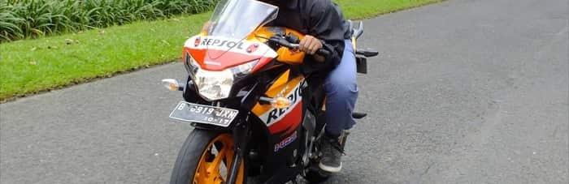

<body>
<link rel="stylesheet" href="https://cdn.jsdelivr.net/npm/bulma@0.9.0/css/bulma.min.css">

    

        
    

    

        <h4 class="subtitle is-6"><i>Hi! my name is</i></h4>
        <h2 class="title is-3 has-text-centered">Erlangga Ibrahim</h4>
        <h4 class="subtitle is-7"><i>Or, you can call me</i></h4>
        <h2 class="title is-5 has-text-centered">Wowotek</h4>
    

    

        <section>
            

                <i class="fas fa-user fa-2x"></i>
                <h4 class="title is-4" style="display: inline;">Profile</h4>
            

            <article>
            what
            </article>
        </section>
    

    

    

</body>

<!-- ### Hi there 👋 -->

<!--
**wowotek/wowotek** is a ✨ _special_ ✨ repository because its `README.md` (this file) appears on your GitHub profile.

Here are some ideas to get you started:

- 🔭 I’m currently working on ...
- 🌱 I’m currently learning ...
- 👯 I’m looking to collaborate on ...
- 🤔 I’m looking for help with ...
- 💬 Ask me about ...
- 📫 How to reach me: ...
- 😄 Pronouns: ...
- ⚡ Fun fact: ...
-->
